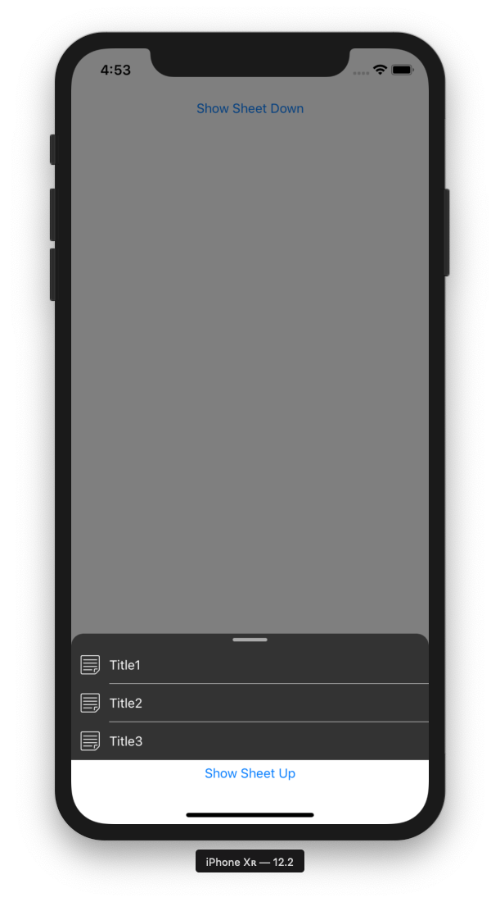

# SPSheetKit

[](https://travis-ci.org/shiqp/SPSheetKit)
[](https://cocoapods.org/pods/SPSheetKit)
[](https://cocoapods.org/pods/SPSheetKit)
[](https://cocoapods.org/pods/SPSheetKit)

## Summary

`SPSheetKit` is a light kit to present sheet controller as below.





## Installation

SPSheetKit is available through [CocoaPods](https://cocoapods.org). To install
it, simply add the following line to your Podfile:

```ruby
pod 'SPSheetKit'
```
## Usage

1. Import:
```swift
import SPSheetKit
```

2. Init menu item:
```swift
let menuItem = SPSheetMenuItem(title: "Title", image: UIImage(named: "note"), action: #selector(onMenuItemTapped))
```

3. Config the sheet colors:
```swift
SPSheetColors.background: UIColor = .black
SPSheetColors.content: UIColor = .white
SPSheetColors.separator: UIColor = .white
SPSheetColors.dragSlider: UIColor = .lightGray
```

4. Init and present sheet controller:
```swift
let sheet = SPSheetController(sourceView: sender, sourceRect: sender.bounds, presentationOrigin: sender.frame.minY, presentationDirection: .up)
sheet.menuItems.append(menuItem)
self.present(sheet, animated: true)
```

## Author

shiqp, qingpu.shi@gmail.com

## License

SPSheetKit is available under the MIT license. See the LICENSE file for more info.
